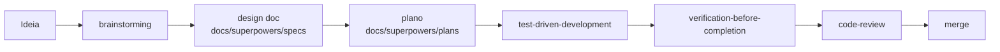

# AGENTS.md - Guia para agentes de IA no Postr

Este arquivo orienta qualquer agente de IA (Cursor, etc.) que trabalhe neste repositório. Leia-o antes de implementar qualquer mudança relevante.

## O que é o Postr

Leitor de artigos sem distrações, local-first, entregue como PWA. O usuário salva um link, um Cloudflare Worker extrai o conteúdo principal e o app oferece uma leitura limpa. Escopo, princípios e não-objetivos estão em [docs/product/PRD.md](docs/product/PRD.md).

## Princípio central: Spec-Driven Development (Superpowers)

Nada de código de produto sem um design aprovado. Toda mudança relevante segue o fluxo abaixo. O processo detalhado e o mapa de skills estão em [docs/superpowers/README.md](docs/superpowers/README.md).

1. **brainstorming** - explorar intenção, restrições e critérios de sucesso; propor 2-3 abordagens; produzir um design doc em `docs/superpowers/specs/YYYY-MM-DD-<topico>-design.md`.
2. **writing-plans** - transformar o design aprovado em um plano em `docs/superpowers/plans/`.
3. **test-driven-development** - escrever o teste antes da implementação.
4. **verification-before-completion** - rodar comandos de verificação e confirmar a saída antes de afirmar que algo está pronto.
5. **code-review** - revisar contra o plano e os padrões antes de integrar.

Mudanças triviais (typo, ajuste de cópia, correção óbvia de 1-2 linhas) podem pular o ciclo completo, mas ainda passam por verificação.

## Mapa da documentação

| Área | Documento | Papel |
| --- | --- | --- |
| Produto | [docs/product/PRD.md](docs/product/PRD.md) | Por que o produto existe, para quem, escopo |
| Engenharia | [docs/engineering/architecture-and-backlog.md](docs/engineering/architecture-and-backlog.md) | Estado técnico atual, problemas e backlog priorizado |
| Operações | [docs/operations/deploy.md](docs/operations/deploy.md) | Deploy (CI/CD FTP + fallback manual) |
| Decisões | [docs/decisions/README.md](docs/decisions/README.md) | ADRs (registros de decisão) |
| Processo | [docs/superpowers/README.md](docs/superpowers/README.md) | Fluxo SDD, templates e skills |
| Specs | `docs/superpowers/specs/` | Design docs por entrega |
| Planos | `docs/superpowers/plans/` | Planos de implementação |

Regra: **PRD é fonte de verdade de produto**; **architecture-and-backlog é fonte de verdade técnica**; **cada design doc é fonte de verdade de uma entrega**. Ao mudar de direção, atualize o PRD; ao mudar o sistema, atualize a arquitetura.

## Mapa do código

- `src/main.tsx` - roteador e bootstrap
- `src/App.tsx` - shell, topbar e navegação global
- `src/pages/` - páginas (Home, Reader, ReadOnly, Articles, ShareTarget, Account, About)
- `src/components/` - componentes de UI
- `src/db/schema.ts` - Dexie/IndexedDB e utilitários de tags
- `src/lib/parser.ts` - cliente do serviço de extração
- `cloudflare/src/index.ts` - Worker de parsing (boundary do sistema)
- `vite.config.ts` + `public/sw-custom.js` - PWA, manifest e share target

## Convenções de engenharia (do backlog técnico)

Ao mexer em código, respeite as direções já acordadas em [docs/engineering/architecture-and-backlog.md](docs/engineering/architecture-and-backlog.md):

- **Casos de uso explícitos**: extrair lógica de produto das páginas para uma camada `src/services`/`src/use-cases` (`saveArticleFromUrl`, `saveSharedArticle`, `loadSavedArticle`, `shareArticle`, `updateArticleTags`). Não continue espalhando lógica nas páginas.
- **Parser como boundary**: tratar a resposta do parser via um contrato tipado e compartilhado; não assumir comportamento implícito.
- **Segurança de HTML**: conteúdo extraído é renderizado com `dangerouslySetInnerHTML`; qualquer mudança exige uma estratégia de sanitização explícita.
- **UI coerente**: substituir `alert`/`confirm` por componentes do app; usar `Link` do router em vez de `href` dentro do SPA.
- **Sem ruído de POC** no caminho de produção (remover UI de debug, artefatos de template).

## Definition of Done

Uma entrega só está pronta quando:

- [ ] Existe design doc aprovado em `docs/superpowers/specs/` (para mudanças não triviais).
- [ ] Existe plano correspondente em `docs/superpowers/plans/` quando a entrega tem múltiplos passos.
- [ ] Código, testes e documentação foram atualizados juntos.
- [ ] Os critérios de aceitação do design doc estão satisfeitos.
- [ ] A verificação foi executada e a saída confirmada (build/lint/testes relevantes), sem afirmar sucesso sem evidência.
- [ ] PRD e/ou architecture-and-backlog foram atualizados se a direção ou o sistema mudaram.

## O que evitar agora

- Adicionar autenticação ou sincronização antes de estabilizar o core (ver não-objetivos no PRD).
- Crescer a UI sem formalizar fluxos.
- Corrigir comportamento direto nas páginas em vez de extrair casos de uso.
- Tratar o parser como detalhe de implementação em vez de boundary do sistema.
