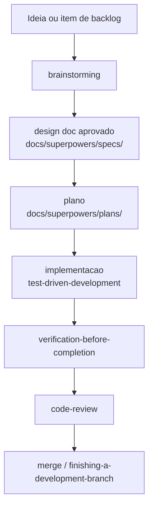

# Processo SDD / Superpowers - Postr

Este diretório contém o processo de desenvolvimento do Postr e os artefatos que ele produz. A filosofia é Spec-Driven Development (SDD) apoiada pelas skills do plugin Superpowers: cada mudança relevante passa por design antes de código, e por verificação antes de ser considerada pronta.

Para o resumo operacional e as convenções de engenharia, ver [AGENTS.md](../../AGENTS.md).

## Por que este processo

A base do Postr nasceu como POC. O objetivo desta fase é transformá-la em produto mantendo clareza, confiabilidade e capacidade de evolução (ver [PRD](../product/PRD.md) e [arquitetura](../engineering/architecture-and-backlog.md)). SDD reduz retrabalho: pensamos no problema, escrevemos o design, alinhamos, e só então implementamos com testes.

## O fluxo



### 1. Brainstorming (skill `brainstorming`)

Explorar intenção, restrições e critérios de sucesso, uma pergunta por vez. Propor 2-3 abordagens com trade-offs. Resultado: um design doc em `specs/YYYY-MM-DD-<topico>-design.md` usando o [TEMPLATE-design.md](specs/TEMPLATE-design.md). Não escrever código antes do design aprovado.

### 2. Escrever o plano (skill `writing-plans`)

Transformar o design aprovado em um plano de implementação em `plans/YYYY-MM-DD-<topico>-plan.md` usando o [TEMPLATE-plan.md](plans/TEMPLATE-plan.md). Tarefas pequenas, testáveis e ordenadas.

### 3. Implementar com TDD (skill `test-driven-development`)

Escrever o teste antes da implementação. Cobrir os fluxos críticos citados na arquitetura (salvar artigo, parser, share target).

### 4. Verificar antes de concluir (skill `verification-before-completion`)

Rodar build/lint/testes relevantes e confirmar a saída. Nunca afirmar "pronto" sem evidência.

### 5. Revisar (subagent `code-reviewer` / skill `requesting-code-review`)

Revisar contra o design doc, o plano e as convenções antes de integrar.

### 6. Finalizar (skill `finishing-a-development-branch`)

Decidir merge/PR/limpeza quando a implementação estiver completa e verificada.

Skills de apoio: `systematic-debugging` (bugs e falhas de teste), `using-git-worktrees` (isolar trabalho), `dispatching-parallel-agents` (tarefas independentes).

## Estrutura de pastas

```
docs/superpowers/
├── README.md                  (este arquivo)
├── specs/
│   ├── TEMPLATE-design.md      (template de design doc)
│   └── YYYY-MM-DD-<topico>-design.md
└── plans/
    ├── TEMPLATE-plan.md        (template de plano)
    └── YYYY-MM-DD-<topico>-plan.md
```

Convenções:

- Um design doc por entrega. Nome: `YYYY-MM-DD-<topico>-design.md` (data de criação).
- Um plano por design doc, mesmo `<topico>`.
- Decisões arquiteturais que atravessam entregas viram ADRs em [../decisions/](../decisions/README.md).

## Backlog de specs (stubs criados)

Estes stubs consolidam o backlog do [PRD](../product/PRD.md) (secao 21) e da [arquitetura](../engineering/architecture-and-backlog.md) (secao 10). Cada um está pronto para o brainstorming preencher.

| Prioridade | Spec |
| --- | --- |
| P0 | [salvar-artigo](specs/2026-07-11-salvar-artigo-design.md) |
| P0 | [parser-contract](specs/2026-07-11-parser-contract-design.md) |
| P0 | [share-target-pwa](specs/2026-07-11-share-target-pwa-design.md) |
| P0 | [seguranca-html-extraido](specs/2026-07-11-seguranca-html-extraido-design.md) |
| P1 | [biblioteca-e-tags](specs/2026-07-11-biblioteca-e-tags-design.md) |
| P1 | [leitura-limpa](specs/2026-07-11-leitura-limpa-design.md) |
| P1 | [compartilhar-artigo](specs/2026-07-11-compartilhar-artigo-design.md) |

## Como começar uma entrega

1. Escolha um item do backlog acima (ou crie um novo stub a partir do template).
2. Rode o brainstorming para preencher o design doc e obtenha aprovação.
3. Gere o plano correspondente em `plans/`.
4. Implemente com TDD, verifique e peça review.
