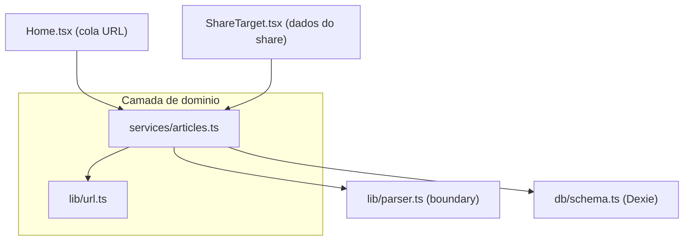

# Salvar artigo - Design

Status: Aprovado
Data: 2026-07-11
Autor(es): -
Prioridade: P0
Relacionado: [PRD secao 10 e 19.1](../../product/PRD.md) | [Arquitetura secao 5.1 e 9.1](../../engineering/architecture-and-backlog.md)

## 1. Contexto e problema

Salvar um artigo (capturar uma URL e persistir o conteúdo extraído localmente) é o fluxo central do Postr. Hoje a lógica está espalhada e duplicada:

- `extractUrlFromText` + `SHARE_SERVICE_DOMAINS` existem idênticos em [`src/pages/Home.tsx`](../../../src/pages/Home.tsx) e [`src/pages/ShareTarget.tsx`](../../../src/pages/ShareTarget.tsx).
- A sequência `crypto.randomUUID()` -> `parseArticleFromUrl` -> `db.articles.add(...)` -> `navigate('/reader/:id')` está copiada nas duas páginas.
- `ShareTarget` tem um bug: no `catch` referencia `cleanUrl`, declarado dentro do `try` (arquitetura secao 7.2), além de renderizar uma UI de debug em produção.
- Não há deduplicação: salvar a mesma URL duas vezes cria dois registros.

O objetivo é extrair um caso de uso reutilizável e confiável, deixando as páginas responsáveis apenas por UI e navegação.

## 2. Objetivos e não-objetivos

- Objetivos:
  - Caso de uso reutilizável de salvar artigo, agnóstico de framework, consumido por Home e ShareTarget.
  - Utilitário único de extração/normalização de URL (remover duplicação).
  - Deduplicação por URL: ao salvar uma URL já existente, navegar para o artigo salvo sem recriar.
  - Modelo de resultado tipado (sucesso vs categorias de falha) para a UI escolher a mensagem.
  - Base de testes do frontend (Vitest) construída junto, com o serviço feito test-first.
- Não-objetivos:
  - Camada de transporte do share (manifest, service worker, decisão GET vs POST) -> spec `share-target-pwa`.
  - Contrato tipado do parser e taxonomia fina de erro -> spec `parser-contract`.
  - Sanitização do HTML renderizado -> spec `seguranca-html-extraido`.
  - Tema, update PWA, UI de biblioteca/tags.

## 3. Abordagens consideradas

- Opção A - Serviço puro em `src/services` + resultado tipado. Funções agnósticas de framework, páginas finas. Mais testável; serve de fundação para os demais casos de uso (`loadSavedArticle`, `shareArticle`).
- Opção B - Hook React `useSaveArticle()`. Idiomático em React, mas acopla o caso de uso ao React e dificulta teste unitário puro.
- Opção C - Extrair só o utilitário de URL. Mínimo; não cumpre a meta de consolidar o caso de uso.
- Recomendada e aprovada: **Opção A**.

## 4. Design proposto

### 4.1 Arquitetura



### 4.2 Utilitário de URL (`src/lib/url.ts`)

Move o código duplicado das páginas para um único módulo puro:

- `SHARE_SERVICE_DOMAINS` - lista de domínios de serviços intermediários de share.
- `extractUrlFromText(text: string): string | null` - extrai URL de um texto; com múltiplas URLs, prioriza a que não é de serviço de share (comportamento atual).
- `pickSharedUrl(input: { url?: string | null; text?: string | null; title?: string | null }): string | null` - aplica `extractUrlFromText` com prioridade `url` -> `text` -> `title` (replica o ShareTarget atual).
- `normalizeUrlForDedup(url: string): string` - normaliza apenas para comparação de duplicata: host em minúsculas, remove barra final e parâmetros de tracking (`utm_*`, `fbclid`, `gclid`). A URL armazenada e aberta continua sendo a original (não normalizada).

### 4.3 Serviço (`src/services/articles.ts`)

```ts
export type SaveFailureReason =
  | 'no-url'
  | 'blocked'
  | 'unparseable'
  | 'network'
  | 'unknown'

export type SaveArticleResult =
  | { ok: true; id: string; alreadyExisted: boolean }
  | { ok: false; reason: SaveFailureReason; url?: string }

export function saveArticleFromUrl(rawUrl: string): Promise<SaveArticleResult>
export function saveSharedArticle(input: {
  url?: string | null
  text?: string | null
  title?: string | null
}): Promise<SaveArticleResult>
```

`saveArticleFromUrl(rawUrl)`:

1. Limpar/extrair a URL: se `rawUrl` não começa com `http`, tentar `extractUrlFromText`. Se nada for encontrado, retornar `{ ok: false, reason: 'no-url' }`.
2. Deduplicar: calcular `normalizeUrlForDedup` e consultar `db.articles` por um registro existente com a mesma URL normalizada. Se existir, retornar `{ ok: true, id: existente.id, alreadyExisted: true }` (sem chamar o parser).
3. Extrair conteúdo via `parseArticleFromUrl`. Em erro, mapear para `reason` (ver 4.4) e retornar `{ ok: false, reason, url }`.
4. Persistir com `crypto.randomUUID()`, `tags: []`, `savedAt: Date.now()`. Retornar `{ ok: true, id, alreadyExisted: false }`.

`saveSharedArticle(input)`: usa `pickSharedUrl` para obter a URL e delega a `saveArticleFromUrl`. Se `pickSharedUrl` retornar `null`, resultado `{ ok: false, reason: 'no-url' }`. O fallback de extrair da `location.href` é transporte e permanece no ShareTarget.

### 4.4 Modelo de erro

O serviço captura falhas do parser e mapeia para `SaveFailureReason` de forma grosseira nesta entrega:

- Falha de rede (fetch lança, ex. `TypeError`) -> `network`.
- Resposta HTTP não-ok com status de bloqueio/erro upstream -> `blocked`.
- Parser retorna 422 / "unable to parse" -> `unparseable`.
- Qualquer outro caso -> `unknown`.

A taxonomia precisa virá da spec `parser-contract`, que depois alimentará estes mesmos `reason`. A UI decide a mensagem a partir do `reason`.

### 4.5 Integração das páginas

- `Home`: `onSave` chama `saveArticleFromUrl(url)`. Em `ok`, navega para `/reader/:id` com estado `{ newArticle: !alreadyExisted, alreadyExisted }`. Em falha, mostra `BlockedErrorView` com mensagem por `reason` (`no-url` -> "Nenhuma URL válida encontrada"; `blocked` -> "site bloqueou"; demais -> mensagem genérica com opção de abrir original quando houver `url`).
- `ShareTarget`: coleta `{ url, text, title }` de `window.__SHARE_TARGET_DATA__` / query params, aplica o fallback de `location.href` (permanece aqui), chama `saveSharedArticle` e navega ou mostra erro. Remove a UI de debug e o estado de debug; corrige o bug do `cleanUrl` (o resultado carrega `reason`/`url`).
- Duplicata: quando `alreadyExisted`, navegar para o artigo com aviso leve (via estado de navegação `alreadyExisted`). UI do aviso mantida mínima nesta entrega.

## 5. Impacto no código

- Novo: `src/lib/url.ts`, `src/services/articles.ts`.
- Novo (testes): `vitest.config.ts`, `src/lib/url.test.ts`, `src/services/articles.test.ts`; devDeps `vitest` e `fake-indexeddb`; script `"test": "vitest"` em `package.json`.
- Alterado: `src/pages/Home.tsx` (usa o serviço), `src/pages/ShareTarget.tsx` (usa o serviço, remove debug, corrige bug).
- Inalterado nesta entrega: `src/lib/parser.ts`, `src/db/schema.ts` (consumidos como estão).

## 6. Critérios de aceitação

- [ ] `extractUrlFromText`, `pickSharedUrl` e `normalizeUrlForDedup` existem em `src/lib/url.ts` e as páginas não têm mais cópias dessa lógica.
- [ ] `saveArticleFromUrl` e `saveSharedArticle` existem em `src/services/articles.ts` e retornam `SaveArticleResult`.
- [ ] Salvar uma URL nova cria um registro com `tags: []` e navega para a leitura.
- [ ] Salvar uma URL já existente (após normalização) navega para o artigo existente com `alreadyExisted: true` e não cria novo registro.
- [ ] Entrada sem URL válida retorna `no-url` e a UI mostra a mensagem correspondente sem salvar.
- [ ] Falha do parser não salva nada e retorna o `reason` mapeado; a UI mostra a mensagem correspondente.
- [ ] `Home` e `ShareTarget` consomem o serviço; `ShareTarget` não renderiza UI de debug e não tem o bug de escopo do `cleanUrl`.
- [ ] Vitest roda via `npm test`; testes de `url.ts` e `articles.ts` passam.

## 7. Plano de testes

`src/lib/url.test.ts`:

- `extractUrlFromText`: uma URL; múltiplas URLs preferindo a que não é de share; texto sem URL retorna `null`.
- `pickSharedUrl`: prioridade `url` -> `text` -> `title`; nenhum candidato retorna `null`.
- `normalizeUrlForDedup`: remove `utm_*`/`fbclid`/`gclid`, barra final e normaliza host; URLs equivalentes colidem.

`src/services/articles.test.ts` (parser mockado via `vi.mock('@/lib/parser')`, Dexie sobre `fake-indexeddb`):

- salvar novo: retorna `{ ok: true, alreadyExisted: false }` e grava com `tags: []`.
- dedup: segunda chamada com URL equivalente retorna o mesmo `id` e `alreadyExisted: true`, sem novo registro.
- `no-url`: entrada sem URL retorna `{ ok: false, reason: 'no-url' }`.
- mapeamento de erro: parser lançando erro de rede -> `network`; 422 -> `unparseable`; status de bloqueio -> `blocked`; outro -> `unknown`.

## 8. Riscos e questões em aberto

- Dedup não resolve redirecionamentos: dois short-links diferentes para o mesmo artigo final não são detectados como duplicata (aceitável nesta entrega; melhoria futura poderia deduplicar pela `url` final retornada pelo parser).
- O mapeamento de `reason` é heurístico até a spec `parser-contract` formalizar o contrato; os nomes de `reason` são estáveis, o mapeamento pode ficar mais preciso depois.
- O aviso visual de "já estava na biblioteca" é mínimo nesta entrega; refino de UX pode vir com a spec de biblioteca/leitura.

## 9. Referências

- Plano: `../plans/2026-07-11-salvar-artigo-plan.md` (a criar)
- Specs relacionadas: [parser-contract](2026-07-11-parser-contract-design.md), [share-target-pwa](2026-07-11-share-target-pwa-design.md), [seguranca-html-extraido](2026-07-11-seguranca-html-extraido-design.md)
